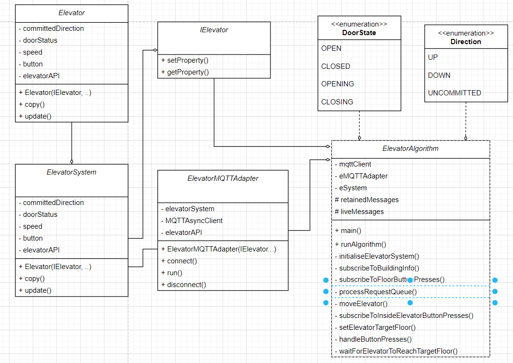

# sqelevator-proj
Group assignment SQElevator


package at.fhhagenberg.sqelevator ist der full qualified name vom IElevator und darf nicht verändert werden.
im repo ist ein codeexample von Elevator auf sqelevator zu finden.
wichtig ist, das erst eine neue target, oder committed direction gesetzten werden darf, wenn der elevator die türen geoffnet hat.!!!!
bei rmiexception, oder nach langer zeit ein timeout ist, dann ist die verbindung abgelaufen. was auch sein kann ist, das der simulator stehen geblieben ist.

das elevatorsystem muss nicht zwingend mit mehreren liften funktionieren. es reicht, wenn einer entsprechend des git examples hoch und runterfahren kann, entsprechend seiner ziele.
aufgrund dessen das Felix nicht macht wurde der elevatoralgorithm vereinfach.

IElevator lässt seinen clocktick abfragen. wenn man immer alles abfragt kann es sein, das unter den calls das rmi interface geupdated wird. hier ist dann wichtig, dass am anfang und ende die clockticks abgefragt werden, dann kann man
dies überprüfen und darauf reagieren.


netzwerkverbindungsabbrüche können simuliert werden, indem die elevatorsimulation gestoppt wird und das simulationsfenster (aber nicht das programm) geschlossen wird.

# MQTT-Adapter
| **Veröffentlichungshäufigkeit** | **Themen (Topics)**                          | **Beschreibung**                      |
|----------------------------------|---------------------------------------------|---------------------------------------|
| **Regelmäßig (periodisch)**     | `elevator/{id}/currentFloor`                | Aktuelle Etage                        |
|                                  | `elevator/{id}/targetedFloor`               | Ziel-Etage                            |
|                                  | `elevator/{id}/speed`                       | Geschwindigkeit                       |
|                                  | `elevator/{id}/weight`                      | Gewicht                               |
|                                  | `elevator/{id}/doorState`                   | Türstatus                             |
| **Einmalig (retained)**          | `building/info/numberOfElevators`           | Anzahl der Aufzüge                    |
|                                  | `building/info/numberOfFloors`              | Anzahl der Etagen                     |
|                                  | `building/info/floorHeight/feet`            | Etagenhöhe                            |
|                                  | `building/info/systemClockTick`             | System-Takt                           |
|                                  | `building/info/rmiConnected`                | RMI-Verbindungsstatus                 |

# Installation 
## Simulator

Der Elevator Simulator befindet sich im Ordner ElevatorSimulator innerhalb des Projekt-Root-Ordners. Im Ordner "bin" befinden sich die Shell-Skripte zum Ausführen. 
Das vorgegebene OnlyOne-Szenario wurde als Basis für unseren Simulator verwendet.

Windows: 
```shell
ElevatorSimulator/bin/elevator.bat
```

oder mit Linux
```shell
ElevatorSimulator/bin/elevator.sh
```


## Java JAR
Das Java JAR Datei befindet sich in dem selben Ordner und kann mit dem folgenden Befehl gestartet werden

```shell
java -jar ElevatorSimulator/mqtt-elevator-team-c-1.0-jar-with-dependencies.jar
```

# Klassendiagram




