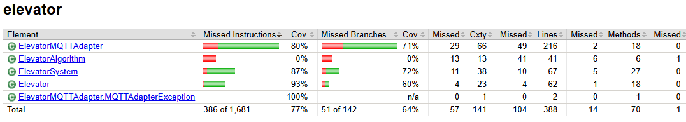

# Klassendiagramm


# MQTT-Topics

| **Veröffentlichungshäufigkeit** | **Themen (Topics)**           | **Beschreibung** |
| --------------------------------------- | ----------------------------------- | ---------------------- |
| **Regelmäßig (periodisch)**     | `elevator/{id}/currentFloor`      | Aktuelle Etage         |
|                                         | `elevator/{id}/targetedFloor`     | Ziel-Etage             |
|                                         | `elevator/{id}/speed`             | Geschwindigkeit        |
|                                         | `elevator/{id}/weight`            | Gewicht                |
|                                         | `elevator/{id}/doorState`         | Türstatus             |
|                                         | `elevator/{id}/button/{floor_id}` | Lift Knopf             |
|                                         | `floor/{id}/buttonUp`             | Stock Knopf nach oben  |
|                                         | `floor/{id}/buttonUp`             | Stock Knopf nach unten |
| **Einmalig (retained)**           | `building/info/numberOfElevators` | Anzahl der Aufzüge    |
|                                         | `building/info/numberOfFloors`    | Anzahl der Etagen      |
|                                         | `building/info/floorHeight/feet`  | Etagenhöhe            |

| **ControlTopics** | **Themen (Topics)**           | **Beschreibung** |
| --------------------------------------- | ----------------------------------- | ---------------------- |
| **Empfängt**     | `elevator/{id}/committedDirection`      | Fahrtrichtung auf/ab         |
|                                         | `elevator/{id}/targetedFloor`     | Ziel-Etage             |
|                                         | `elevator/{id}/floorService/{floor_id}`             | Stockwerk befahrbar        |

# Produkt Qualität

**Statische Code Analyse:** Durch SonarCloud bei jedem merge auf GitHub
**Automatisierte Tests:** Durch GitHub Actions

### Ergebnisse der Automatisierten Tests



# Installation 
## Simulator

Der Elevator Simulator befindet sich im Ordner ElevatorSimulator innerhalb des Projekt-Root-Ordners. Im Ordner "bin" befinden sich die Shell-Skripte zum Ausführen. 
Das vorgegebene OnlyOne-Szenario wurde als Basis für unseren Simulator verwendet.

Windows: 
```shell
ElevatorSimulator/bin/elevator.bat
```

oder mit Linux
```shell
ElevatorSimulator/bin/elevator.sh
```


## Java JAR
Das Java JAR Datei befindet sich in dem selben Ordner und kann mit dem folgenden Befehl gestartet werden

```shell
java -jar ElevatorSimulator/mqtt-elevator-team-c-1.0-jar-with-dependencies.jar
```

# Klassendiagram


