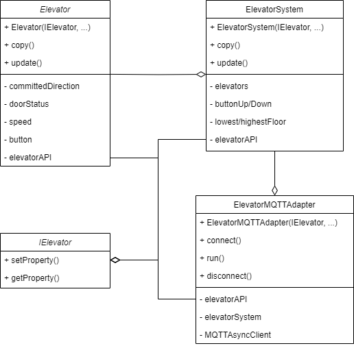
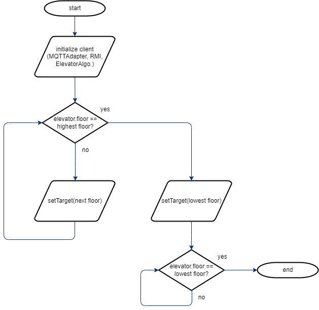

# sqelevator-proj

Group assignment SQElevator

package at.fhhagenberg.sqelevator ist der full qualified name vom IElevator und darf nicht verändert werden.
im repo ist ein codeexample von Elevator auf sqelevator zu finden.
wichtig ist, das erst eine neue target, oder committed direction gesetzten werden darf, wenn der elevator die türen geoffnet hat.!!!!
bei rmiexception, oder nach langer zeit ein timeout ist, dann ist die verbindung abgelaufen. was auch sein kann ist, das der simulator stehen geblieben ist.

das elevatorsystem muss nicht zwingend mit mehreren liften funktionieren. es reicht, wenn einer entsprechend des git examples hoch und runterfahren kann, entsprechend seiner ziele.
aufgrund dessen das Felix nicht macht wurde der elevatoralgorithm vereinfach.

IElevator lässt seinen clocktick abfragen. wenn man immer alles abfragt kann es sein, das unter den calls das rmi interface geupdated wird. hier ist dann wichtig, dass am anfang und ende die clockticks abgefragt werden, dann kann man
dies überprüfen und darauf reagieren.

netzwerkverbindungsabbrüche können simuliert werden, indem die elevatorsimulation gestoppt wird und das simulationsfenster (aber nicht das programm) geschlossen wird.
# Anforderungen
*   Es wird JDK-17, bzw. JDK-22 benötigt, da ansonsten die Tests mit der aktuellsten JDK-23 Version nicht durchlaufen.
*   Docker (z.B. Docker-Desktop)

# Klassendiagramm

# MQTT-Topics

| **Veröffentlichungshäufigkeit** | **Themen (Topics)**           | **Beschreibung** |
| --------------------------------------- | ----------------------------------- | ---------------------- |
| **Regelmäßig (periodisch)**     | `elevator/{id}/currentFloor`      | Aktuelle Etage         |
|                                         | `elevator/{id}/targetedFloor`     | Ziel-Etage             |
|                                         | `elevator/{id}/speed`             | Geschwindigkeit        |
|                                         | `elevator/{id}/weight`            | Gewicht                |
|                                         | `elevator/{id}/doorState`         | Türstatus             |
|                                         | `elevator/{id}/button/{floor_id}` | Lift Knopf             |
|                                         | `floor/{id}/buttonUp`             | Stock Knopf nach oben  |
|                                         | `floor/{id}/buttonUp`             | Stock Knopf nach unten |
| **Einmalig (retained)**           | `building/info/numberOfElevators` | Anzahl der Aufzüge    |
|                                         | `building/info/numberOfFloors`    | Anzahl der Etagen      |
|                                         | `building/info/floorHeight/feet`  | Etagenhöhe            |

# Produkt Qualität

**Statische Code Analyse:** Durch SonarCloud bei jedem merge auf GitHub
**Automatisierte Tests:** Durch GitHub Actions

### Ergebnisse der Automatisierten Tests

# ElevatorAlgorithm

# Learnings

*   Die richtigen Versionen für die Abhängigkeiten im pom.xml zu finden damit alles kompatibel ist, ist nicht einfach und benötigt viel Zeit.
*   Mehr Zeit in die Planung des Datenmodels zu investieren spart Zeit bei der Implementierung und vermeidet Änderungen im Nachhinein.
*   Das Testen von zeitlich abhängigen Eigenschaften ist nicht einfach und benötigt Übung (MQTTAdapter). Entsprechend gute Tests zu schreiben ist schwer.

# Ausführen des Programms
-   docker run -it -p 1883:1883 -p 9001:9001 eclipse-mosquitto:latest
-   ElevatorSim starten
-   Programm ausführen
